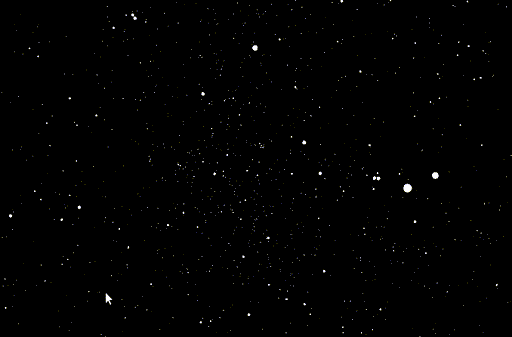

# Shader feedback cables cannot be saved or copied.

## Summary
I've been using feeback loops in shaders to do some computation on the GPU before rendering. This is possible in cables and works wonderfully until I need to save/load or copy/paste the ops at which point the the feedback connections are not retained.

## Minimal example
The shader connections below can be created in cables without any warnings or errors that I've noticed.
 

However when I try to copy and paste the ops elsewhere or if I close (and save) the patch and come back to it later, this is what I get (no feedback cables). The patch can be seen [here](https://cables.gl/p/5ded870171812c58d5b12059?s=0sxmsLQ7woY1XTyf).
 

## Actual use case
The [Buggy](https://cables.gl/p/5d632b1a39bc0245fe2d6f95?s=bfTuFI7EU1oU8Dq4) patch is an example of how the feedback functionality can actually be used. If you open it, the feedback connections probably won't exist (hence the bug report) but the patch is supposed to look like this:
 

The ping-pong stuff in the middle makes it a little messy but it enables n-body simulations so the results are kinda cool:

(Just in case I get told I'm not using cables correctly I wanted to show it actually works)
